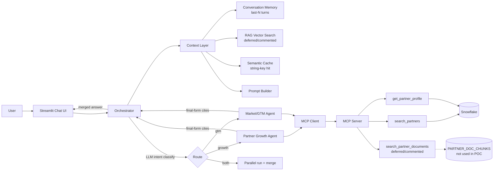

# TCC Partner Intelligence — Architecture Flow (POC)

Owner scope: **LLM Agent design, Multi-Agent Orchestrator, Context Layer**
Status: **implemented** (all layers built and tested; end-to-end gated on credentials)

> **2026-08-10 — RAG code restored but calls disabled.** The RAG vector pipeline
> (`app/rag/*`), config settings, and repository doc-chunk methods have been
> **restored** to full working code. Only their **call sites** stay commented —
> the `search_partner_documents` MCP tool is off. Semantic cache is a
> **string-key** cache (normalized query match) so the POC runs with only a chat
> LLM key; the old embedding-similarity implementation is preserved as a comment
> below the active code.

---

## 1. Reference Architecture

```text
Data Sources → MCP & Tools Gateway → Context Layer → Multi-Agent Orchestrator
             → Frontier LLM Router → API/App Layer
```

POC implements one LLM backend at a time behind a switching mechanism (no
multi-LLM routing yet), and Streamlit as the App Layer.

---

## 2. POC Decisions (locked)

| Concern | Decision |
|---|---|
| LLM chat backend | **Groq (gpt-oss)** or **infra-hosted Qwen** — both OpenAI-compatible `/v1` endpoints, selected by `LLM_PROVIDER` |
| Embeddings | Same provider as chat (not used in the POC — RAG deferred) |
| Vector store | **Snowflake table + numpy cosine similarity** (not used in the POC — RAG deferred; re-enable with the RAG pipeline) |
| Agent → data boundary | **MCP client** over Streamable HTTP (`http://127.0.0.1:8000/mcp`) |
| Intent routing | **LLM intent classifier** (structured output → target agent set) |
| Synthesis location | **Per sub-agent final-form answer**; orchestrator merges when multiple agents fire |
| RAG | **Deferred** (PDF extraction → chunk → embed → Snowflake → MCP tool) — code commented out, re-enable later |
| Semantic cache | **String-key** normalized query match (repeat query ≈ $0, shown in demo); embedding-similarity impl kept as comment |
| Conversation memory | Raw last-N turns, **session-only** (no cross-session persistence) |
| App layer | **Streamlit** chat UI (3 demo questions) |
| Containerization | **Podman 5.7 available** — not required for POC (Snowflake/numpy vectors, local Streamlit) |

---

## 3. Agents vs. MCP — Validation Summary

Both POC agents are **valid** against the current MCP (2 Snowflake tools), with
proxies where the brief's stub sources were planned.

| Agent | Brief said pulls | Actual MCP | How it answers |
|---|---|---|---|
| **Partner Growth** ("likely to grow / recruit / invest") | Snowflake + Salesforce | `search_partners`, `get_partner_profile` | Heuristic + LLM scoring over existing fields (revenue, employees, certs, proficiency, tier, program reach, enrollment recency). Salesforce is stubbed → real growth metric does not exist. |
| **Market/GTM** ("regions/technologies gaining momentum") | Snowflake + external enrichment | `search_partners`, `get_partner_profile` | Static momentum proxy: Expert/Advanced capability density per region/technology. No temporal trend in single-snapshot data. |

Gap closed by this plan: the Context-Layer RAG tool — not built before — is
added as a new MCP tool (`search_partner_documents`). **Note:** RAG is currently
deferred (code commented); the live tool set is `search_partners` and
`get_partner_profile` only.

---

## 4. System Flow



---

## 5. Components & Packages

### 5.1 LLM abstraction — `app/llm/`
- `provider.py` — `chat()`, `embed()` interface
- `openai_compatible.py` — single OpenAI-compatible client for both Groq and
  Qwen (base URL + model from config)
- `factory` — constructs provider from `LLM_PROVIDER=groq|qwen`
- Config (`config.py`): `GROQ_API_KEY`, `QWEN_BASE_URL`, `QWEN_MODEL`,
  `LLM_MODEL`, `EMBEDDING_MODEL`, thresholds, MCP URL.

### 5.2 RAG pipeline — `app/rag/` (deferred — commented out, not removed)
- Extract text from `data/generated/documents/*.pdf`
- Chunk by section/paragraph (per partner)
- Embed via provider (`app/llm`)
- Load into Snowflake table `PARTNER_DOC_CHUNKS(partner_id, chunk_text, embedding)`
- Vector search: numpy cosine similarity in repository
- **Status:** commented-out reference only; re-enable when adopting RAG

### 5.3 MCP — `app/mcp_server/server.py` (extend)
- New tool `search_partner_documents(query, partner_id?, top_k)` — **deferred (commented)**
- Repository extension for chunk search — **deferred (commented)**
- `app/repository/snowflake_partner_repository.py` + RAG repo

### 5.4 Context Layer — `app/context/`
- `conversation_memory.py` — session deque, last-N turns
- `semantic_cache.py` — string-key hit detection on normalized queries (embedding impl kept as comment)
- `context_builder.py` — assembles memory + cache + system prompt

### 5.5 Agents — `app/agents/`
- `base_agent.py` — MCP client session, tool loop, citation formatting
- `partner_growth_agent.py` — growth scoring + cited final-form answer
- `market_gtm_agent.py` — region/tech momentum proxy + cited final-form answer

### 5.6 Orchestrator — `app/orchestrator/`
- `intent_classifier.py` — LLM structured output → `{agents:[growth|gtm]}`
- `orchestrator.py` — supervisor: route, run selected agent(s), merge final answers

### 5.7 App layer — `app/ui/app.py`
- Streamlit chat; runs the 3 demo questions; shows intent, route, cache-hit, sources.

---

## 6. Data Model Additions

```text
PARTNER_DOC_CHUNKS (
    partner_id     STRING,
    chunk_index    INT,
    chunk_text     STRING,
    embedding      ARRAY/STRING  -- serialized float vector
)
```

Vector search is numpy cosine in-process over the fetched rows (small corpus:
10 partners, ~10 chunks each).

---

## 7. Build Order (incremental)

1. LLM abstraction + config + provider switch (Groq / Qwen)
2. Embeddings verified on selected provider (fallback path if unsupported) — **deferred with RAG**
3. RAG pipeline + `PARTNER_DOC_CHUNKS` + `search_partner_documents` MCP tool — **deferred (commented)**
4. Context Layer: memory → semantic cache → prompt builder
5. Agent scaffold + MCP client; Partner Growth Agent end-to-end (demo Q1)
6. Market/GTM Agent (demo Q2)
7. Orchestrator: intent classifier + merge logic (demo Q3 — proves multi-agent)
8. Streamlit demo UI + cache-hit visualization
9. Semantic cache wiring + end-to-end run of the 3 demo questions

---

## 8. Demo Questions

1. "Which partners are most likely to grow?" → Partner Growth, Snowflake, single-agent
2. "Which technologies are gaining momentum in [region]?" → GTM, Snowflake, single-agent
3. "Which partners should I recruit, and which regions should I prioritize for them?" → both agents — orchestrator routes + merges (the multi-agent proof)

---

## 9. Testing

- `pytest`: semantic cache (string-key), intent classifier, merge logic (MCP mocked)
- Re-run existing `test_mcp_client.py` + repository tests (no regressions)
- End-to-end smoke: MCP server up → Streamlit/CLI runs the 3 demo questions
  (currently reaches Groq chat with only a chat LLM key; embeddings no longer required)

---

## 10. Pre-requisites & Assumptions

- `GROQ_API_KEY` (and/or Qwen `BASE_URL`+`MODEL`) in `.env` — none present today
- MCP server must be running (`python -m app.mcp_server.http_server`, port 8000)
- Snowflake reachable with existing creds; `PARTNER_DOC_CHUNKS` table created — **only when RAG is re-enabled**
- gpt-oss availability verified on Groq at runtime
- Podman available but unused for POC unless the gateway/server is containerized

---

## 11. Excluded from POC

- Omeda/CDP + public enrichment integration (stubbed)
- Event Agent, Messaging Agent
- Auth/governance, monitoring/observability
- Multi-turn complex reasoning beyond the 3 demo questions
- Frontier LLM Router (multi-provider cost/latency routing) — single switcher only
- **RAG / chunking / document vector search** — deferred for simplicity; code kept as comments (re-enable to adopt)